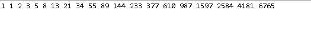
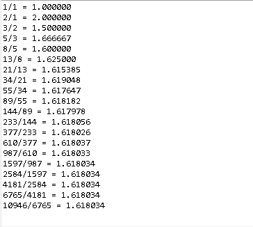
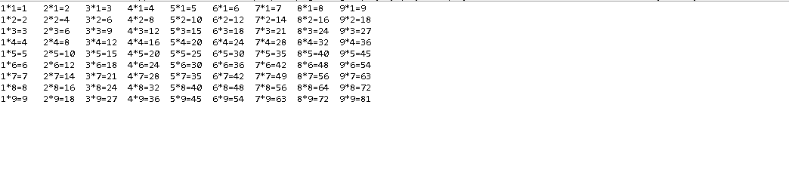
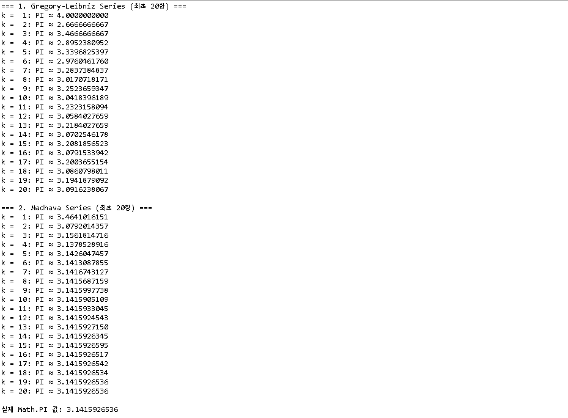
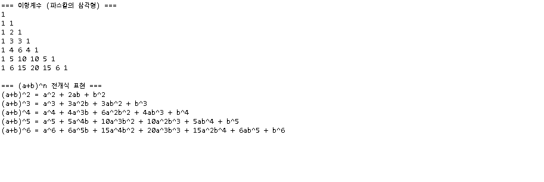
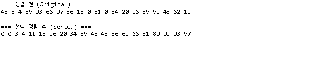
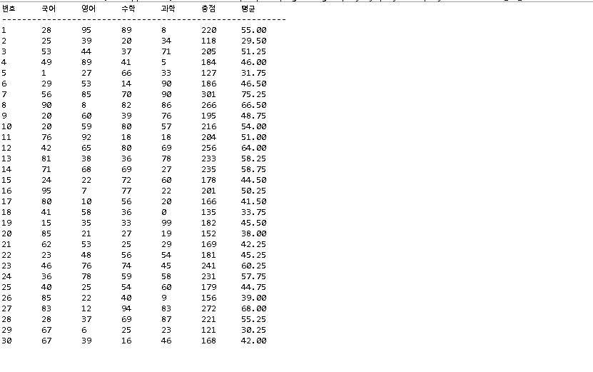

# OOP2026
### Homework1
public class Homework1 {
    public static void main(String[] args) {
        int i, j;

        for (i = 0; i < 10; i++) {
            for (j = 0; j < 10; j++) {
                if (j <= i) {
                    System.out.print("#");
                } else {
                    System.out.print(" ");
                }
            }
            System.out.println("");
        }

        System.out.println();

        for (i = 0; i < 10; i++) {
            for (j = 0; j < 10; j++) {
                if (j < 10 - i) {
                    System.out.print("#");
                } else {
                    System.out.print(" ");
                }
            }
            System.out.println("");
        }

        System.out.println();

        for (i = 0; i < 10; i++) {
            for (j = 0; j < 10; j++) {
                if (j >= 9 - i) {
                    System.out.print("#");
                } else {
                    System.out.print(" ");
                }
            }
            System.out.println("");
        }

        System.out.println();

        for (i = 0; i < 10; i++) {
            for (j = 0; j < 10; j++) {
                if (j >= i) {
                    System.out.print("#");
                } else {
                    System.out.print(" ");
                }
            }
            System.out.println("");
        }
    }
}

package homework;

public class homework2 {
    public static void main(String[] args) {
        int[] fibo = new int[20];

        fibo[0] = 1;
        fibo[1] = 1;

        for (int i = 2; i < 20; i++) {
            fibo[i] = fibo[i - 1] + fibo[i - 2];
        }

        for (int i = 0; i < 20; i++) {
            System.out.print(fibo[i] + " ");
        }
        System.out.println();
    }
}

package homework;

public class homework3 {
    public static void main(String[] args) {
        long[] fibo = new long[22];

        fibo[1] = 1;
        fibo[2] = 1;

        for (int i = 3; i <= 21; i++) {
            fibo[i] = fibo[i - 1] + fibo[i - 2];
        }

        for (int i = 1; i <= 20; i++) {
            double ratio = (double) fibo[i + 1] / fibo[i];
            System.out.printf("%d/%d = %.6f%n", fibo[i + 1], fibo[i], ratio);
        }
    }
} 

package homework;

public class homework4 {
    public static void main(String[] args) {
        int i, j;

        for (j = 1; j <= 9; j++) {
            for (i = 1; i <= 9; i++) {
                System.out.printf("%d*%d=%-2d\t", i, j, i * j);
            }
            System.out.println();
        }
    }
} 

package homework;

public class homework5 {
    public static void main(String[] args) {
        int terms = 20;

        // 1. Gregory-Leibniz Series
        double leibnizSum = 0.0;
        System.out.println("=== 1. Gregory-Leibniz Series (최초 20항) ===");
        for (int k = 0; k < terms; k++) {
            double term = Math.pow(-1, k) / (2 * k + 1);
            leibnizSum += term;
            double currentPi = 4.0 * leibnizSum;
            System.out.printf("k = %2d: PI ≈ %.10f%n", k + 1, currentPi);
        }

        System.out.println();

        // 2. Madhava Series
        double madhavaSum = 0.0;
        double sqrt12 = Math.sqrt(12);
        System.out.println("=== 2. Madhava Series (최초 20항) ===");
        for (int k = 0; k < terms; k++) {
            double term = Math.pow(-1, k) / ((2 * k + 1) * Math.pow(3, k));
            madhavaSum += term;
            double currentPi = sqrt12 * madhavaSum;
            System.out.printf("k = %2d: PI ≈ %.10f%n", k + 1, currentPi);
        }

        System.out.println();
        System.out.printf("실제 Math.PI 값: %.10f%n", Math.PI);
    }
} 

package homework;

public class homework6 {
    public static void main(String[] args) {
        int rows = 7; // 출력할 행의 수 (0차수부터 6차수까지 총 7개 행)
        int[][] binomial = new int[rows][];

        // 1. 가변 2차원 배열 생성 및 이항계수 계산
        for (int n = 0; n < rows; n++) {
            binomial[n] = new int[n + 1];

            for (int k = 0; k <= n; k++) {
                if (k == 0 || k == n) {
                    binomial[n][k] = 1;
                } else {
                    binomial[n][k] = binomial[n - 1][k - 1] + binomial[n - 1][k];
                }
            }
        }

        // 2. 파스칼의 삼각형 계수 형태 출력
        System.out.println("=== 이항계수 (파스칼의 삼각형) ===");
        for (int n = 0; n < rows; n++) {
            for (int k = 0; k <= n; k++) {
                System.out.print(binomial[n][k] + " ");
            }
            System.out.println();
        }

        System.out.println();

        // 3. 다항식 전개식 형태 출력 (차수 2부터 6까지 예시)
        System.out.println("=== (a+b)^n 전개식 표현 ===");
        for (int n = 2; n < rows; n++) {
            System.out.print("(a+b)^" + n + " = ");
            for (int k = 0; k <= n; k++) {
                int coeff = binomial[n][k];
                int aPow = n - k;
                int bPow = k;

                // 계수 출력 (1일 때는 생략, 단 상수항만 남는 경우는 제외)
                if (coeff > 1) {
                    System.out.print(coeff);
                }

                // a의 차수 출력
                if (aPow > 1) {
                    System.out.print("a^" + aPow);
                } else if (aPow == 1) {
                    System.out.print("a");
                }

                // b의 차수 출력
                if (bPow > 1) {
                    System.out.print("b^" + bPow);
                } else if (bPow == 1) {
                    System.out.print("b");
                }

                if (k < n) {
                    System.out.print(" + ");
                }
            }
            System.out.println();
        }
    }
} 

package homework;

public class homework7 {
    public static void main(String[] args) {
        int data[] = new int[20];

        for (int i = 0; i < 20; i++) {
            data[i] = (int) (Math.random() * 100);
        }

        System.out.println("=== 정렬 전 (Original) ===");
        for (int i = 0; i < 20; i++) {
            System.out.print(data[i] + " ");
        }
        System.out.println("\n");

        for (int i = 0; i < 20 - 1; i++) {
            int minIndex = i; 

            for (int j = i + 1; j < 20; j++) {
                if (data[j] < data[minIndex]) {
                    minIndex = j; 
                }
            }

            int temp = data[i];
            data[i] = data[minIndex];
            data[minIndex] = temp;
        }

        System.out.println("=== 선택 정렬 후 (Sorted) ===");
        for (int i = 0; i < 20; i++) {
            System.out.print(data[i] + " ");
        }
        System.out.println();
    }
} 

package homework;

public class homework8 {
    public static void main(String[] args) {
        int students = 30;
        int subjects = 4;

        int[][] score = new int[students][subjects + 1];

        for (int i = 0; i < students; i++) {
            int sum = 0;
            for (int j = 0; j < subjects; j++) {
                score[i][j] = (int) (Math.random() * 101);
                sum += score[i][j];
            }
            score[i][subjects] = sum;
        }

        System.out.printf("%-4s\t%-4s\t%-4s\t%-4s\t%-4s\t%-4s\t%-6s%n", 
                          "번호", "국어", "영어", "수학", "과학", "총점", "평균");
        System.out.println("---------------------------------------------------------");

        for (int i = 0; i < students; i++) {
            int studentNum = i + 1;
            int kor = score[i][0];
            int eng = score[i][1];
            int math = score[i][2];
            int sci = score[i][3];
            int sum = score[i][4];
            double avg = (double) sum / subjects;

            System.out.printf("%-4d\t%-4d\t%-4d\t%-4d\t%-4d\t%-4d\t%-6.2f%n",
                              studentNum, kor, eng, math, sci, sum, avg);
        }
    }
} 
